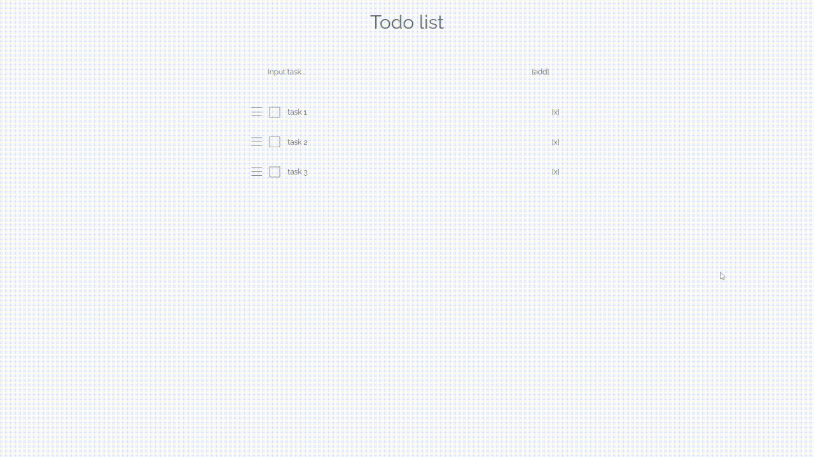

# laravel-vue-practice

A simple application to manage a todo list in Lravel + Vue.js + MySQL.  
To build development environment, I used laradock.

## Backend

I used Laravel as an API server.

I created two kinds of models, Todo and Order. The former is to manage a task list and the latter is to manage the order of Todo.

The summary is the following.

- Todo
  - Model
    - id
      - The unique id.
      - Table type: `int unsigned not null auto_increment primary key`
    - task
      - The task to be completed.
      - Table type: `text`
    - is_done
      - Whether the task has been completed.
      - Table type: `boolean`
  - Controller methods
    - get: Gets the task list.
    - add: Adds a new task.
    - update: Updates the task and its progress.
    - delete: Deletes the task.
- Order
  - Model
    - id
      - The unique id.
      - Table type: `int unsigned not null auto_increment primary key`
    - todo_order
      - The order of the todo list items.
      - Table type: `text`
  - Controller methods
    - get: Gets the todo_order.
    - set: Sets the todo_order.

## Frontend

For the client side, I used Vue.js with SASS.  
I fetched the data from the MySQL database by Fetch API, and built the UI using them.

The code files are in the ./resources/assets/js/ directory, and the details are as follows.

- api/
  - The fetch API functions.
- components/
  - The Vue Component files.
- utils/
  - A set of general functions.
- App.vue
  - The outermost component.
